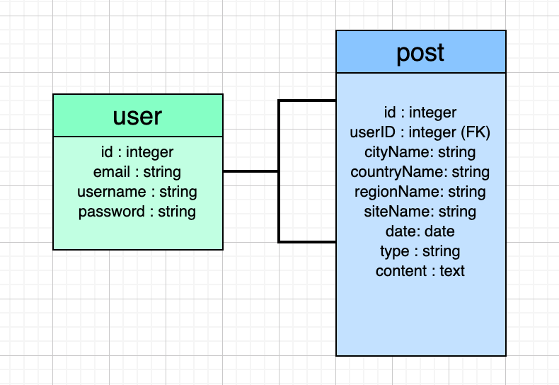
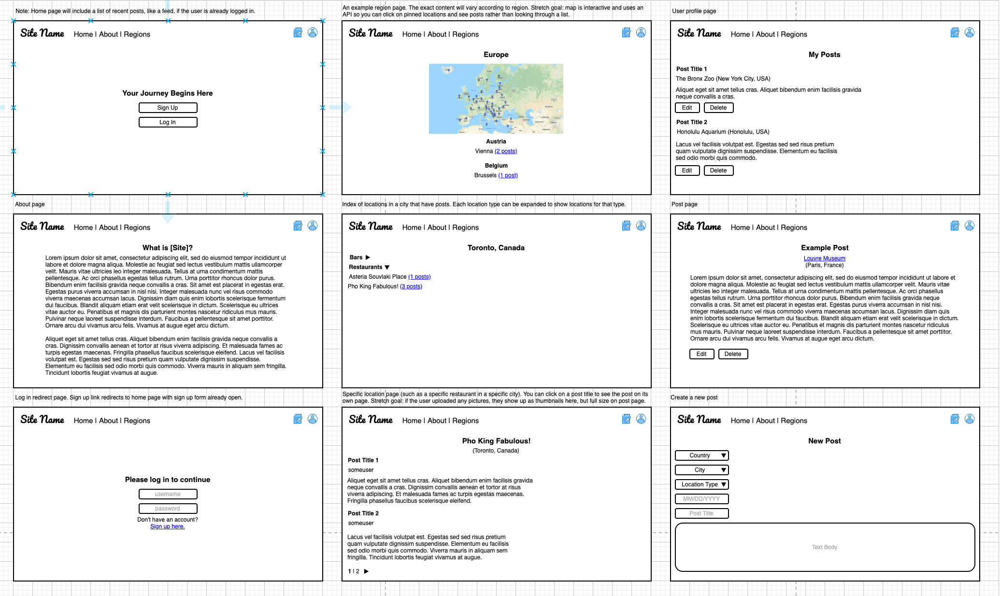
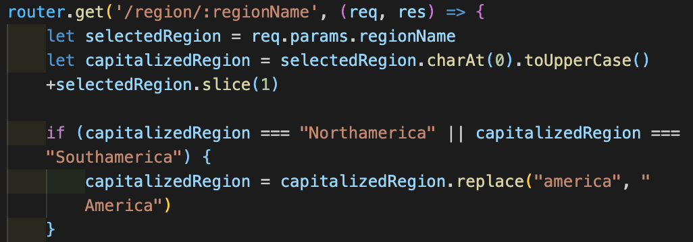
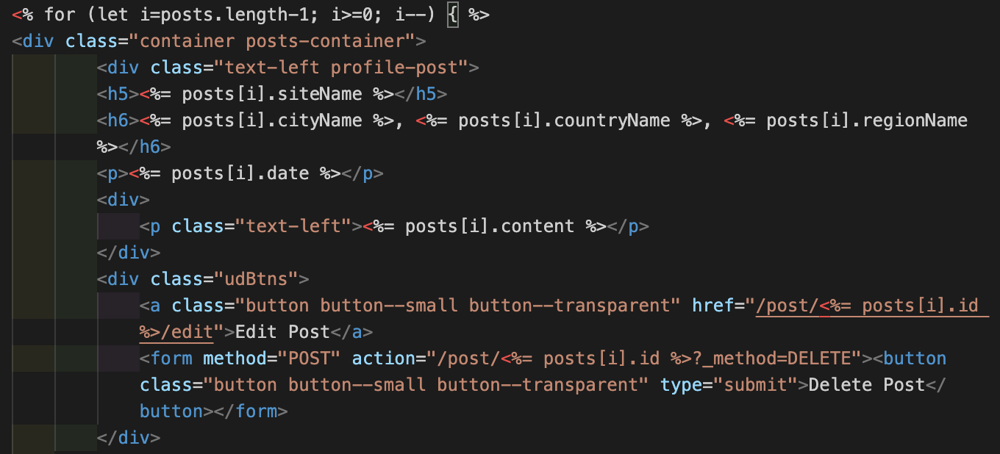

# When In Roam

### About

A community-driven travel blog, where explorers can share their experiences, together. We encourage writers of all levels to share and grow while exploring the world. Whether it's your local coffee shop you stop by every morning or a bar you checked out while jet setting around the world, SHARE, GROW, EXPLORE!

### Development Approach

#### User Stories

* The user lands on a homepage where they can click on an "About" page to learn what the application is used for, select from "Regions" to see what others have posted, and sign up or log in.
* Once signed up and logged in, the user can create a new post by clicking on "New Post", go to their "Profile" page or click on "Regions" to explore posts from other users.
* "New Post" will direct them to a page to enter Region, Country, City, Location Type, Site Name, Date and Content, and then hit submit.
* Once user hits the "submit" button on their new post, the app will render their new entry and redirect them to their "Profile" page to see all of their own posts.
* On the user's profile page, users will be able to edit or delete any of their entries.
* With "Regions", users can select a specific region to explore all posts.

### Design Approach

#### ERD Database

We created a one-to-many Entity Relationship Diagram to help with our planning. One model for users and one model for posts that includes location and content information.

#### Wireframes

These wireframes helped us to navigate and create routes and views and collectively design how we wanted our application to be used.

### Technologies

#### What it includes

* Sequelize user model / migration
* Settings for PostgreSQL
* Passport and passport-local for authentication
* Sessions to keep user logged in between pages
* Passwords that are hashed with BCrypt
* EJS Templating and EJS Layouts
* Sierra-Library framework for CSS
* Sass

#### Default Routes

| Method | Path | Location | Purpose |
| ------ | ---------------- | -------------- | ------------------- |
| GET | / | server.js | Home page |
| GET | /about | index.js | About page |
| GET | /auth/login | auth.js | Login form |
| GET | /auth/signup | auth.js | Signup form |
| POST | /auth/login | auth.js | Login user |
| POST | /auth/signup | auth.js | Creates User |
| GET | / | auth.js | Removes session info |
| GET | /profile/username | index.js | User Profile |
| GET | /new | index.js | New Post form |
| POST | /new | index.js | Creates New Post |
| GET | /post/id/edit | index.js | Post Edit form |
| PUT | /post/id/edit | index.js | Updates Post |
| DELETE | /post/id | index.js | Deletes Post |

#### Coding

 

### Credits

Special shoutout to the following individuals who helped us along the way:
* Brock Whitbred-Cole
* Michael Petty
* James Sinkler
* Jacob Kleiman
* Uyen Lam
* Seanny Phoenix

### Future Features

* Free-form search
* Drop-downs for a New Post for Location Type
* Images associated with posts
* Maps API for interactive maps with pins that indicate places that users have posted about